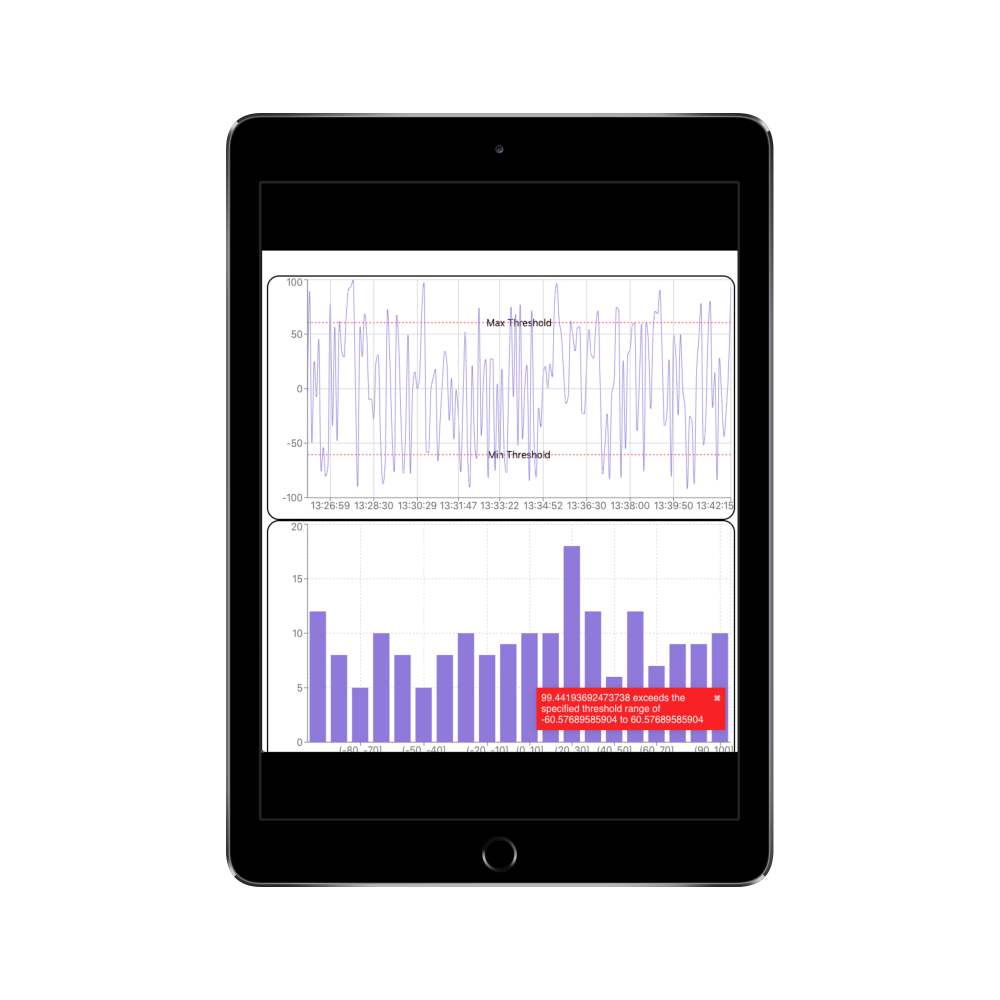

<h1 align="center"> realtime data renderer 👋</h1>
<p>
  
  <a href="https://twitter.com/THEAlexisCarr">
    
  </a>
</p>

You can find the deployed project at [realtime-viz-practice.surge.sh](http://realtime-viz-practice.surge.sh)

## Author

👤 **Alexis J. Carr**

- Twitter: [@THEAlexisCarr](https://twitter.com/THEAlexisCarr)
- Github: [@alexisjcarr](https://github.com/alexisjcarr)

## Show your support

Give a ⭐️ if this project helped you!

# Project Overview

## Task Description

You have a server which returns random numbers via WebSocket ([socket.io](https://socket.io)) connection.

You should implement the following:

1. A line chart:
   - **x-axis**: time of a received number (look at `timestamp` payload field)
   - **y-axis**: number values
2. A bar chart:
   - **x-axis**: range categories (e.g. `-10 - 0`, `0 - 10`, `10 - 20` etc)
   - **y-axis**: the amount of numbers in each category
3. (Optional) An input called _"Alert threshold"_:
   - a user should be able to enter a number
   - if the random number received from the server is greater than the threshold - show an alert toast / snackbar with the number as the payload
4. Design: we appreciate your own design decisions =)

Charts should be updated in real time. **Please**, consider code style best practices.

## Limitations

1. **React**
2. Use [socket.io-client](https://socket.io/docs/client-api) to connect to the server
3. That’s all

# Implementation

## Key Features


1. A real-time time series chart so that the user can see the data values as they come in. Now with visualized user provided threshold range.
2. A histogram so that the user can visualize the count distribution of the different readings.
3. Real-time alerts for when the user's readings exceed the threshold range



4. Responsive for both tablet...


5.  ... and mobile for when the user needs to monitor their data on the go.

## Tech Stack

### Front end built using:

#### React bootstrapped with Create React App

Create React App is a wonderful utility with all of the build tools preconfigured out of the box. This way, the developer can spend more time focusing on the code.

I know that at Corva (and in the industry as a whole) that isomorphic/SSR apps are becoming more popular. If time were permitting, I would migrate this project to a SSR utility such as Next.js or Razzle.

#### React Hooks

React hooks allowed for me to write relatively clean code by abstracting away a lot of state and app logic via custom hooks.

#### Recharts

I tested many charting packages and this one was the one with the most intuitive API.

If time were permitting, I would migrate over to the Highcharts API in order to more closely mimic what Corva uses.

#### React Toastify

A popular React toast/snackbar package with a very easy and intuitive API.

## Testing

#### Enzyme

Enzyme is a React testing library that makes it easier to test React Components' output.

Used primarily to test that the parent App component was rendering all of its child components.

#### React Testing Library

Testing from the user standpoint. "The more your tests resemble the way your software is used, the more confidence they can give you."

Used for snapshot testing and to test the functionality of the user input form component.

#### PropTypes

Used for runtime type checking for React props.

# How to Use

## Install

```sh
yarn install
```

## Usage

```sh
yarn start
```

## Run tests

```sh
yarn test
```

# Want to contribute?

When contributing to this repository, please first discuss the change you wish to make via issue, email, or any other method with the owners of this repository before making a change.

Please note we have a [code of conduct](./CODE_OF_CONDUCT.md). Please follow it in all your interactions with the project.

## Issue/Bug Request

**If you are having an issue with the existing project code, please submit a bug report under the following guidelines:**

- Check first to see if your issue has already been reported.
- Check to see if the issue has recently been fixed by attempting to reproduce the issue using the latest master branch in the repository.
- Create a live example of the problem.
- Submit a detailed bug report including your environment & browser, steps to reproduce the issue, actual and expected outcomes, where you believe the issue is originating from, and any potential solutions you have considered.

### Feature Requests

We would love to hear from you about new features which would improve this app and further the aims of our project. Please provide as much detail and information as possible to show us why you think your new feature should be implemented.

### Pull Requests

If you have developed a patch, bug fix, or new feature that would improve this app, please submit a pull request. It is best to communicate your ideas with the developers first before investing a great deal of time into a pull request to ensure that it will mesh smoothly with the project.

Remember that this project is licensed under the MIT license, and by submitting a pull request, you agree that your work will be, too.

#### Pull Request Guidelines

- Ensure any install or build dependencies are removed before the end of the layer when doing a build.
- Update the README.md with details of changes to the interface, including new plist variables, exposed ports, useful file locations and container parameters.
- Ensure that your code conforms to our existing code conventions and test coverage.
- Include the relevant issue number, if applicable.
- You may merge the Pull Request in once you have the sign-off of two other developers, or if you do not have permission to do that, you may request the second reviewer to merge it for you.

### Attribution

These contribution guidelines have been adapted from [this good-Contributing.md-template](https://gist.github.com/PurpleBooth/b24679402957c63ec426).
